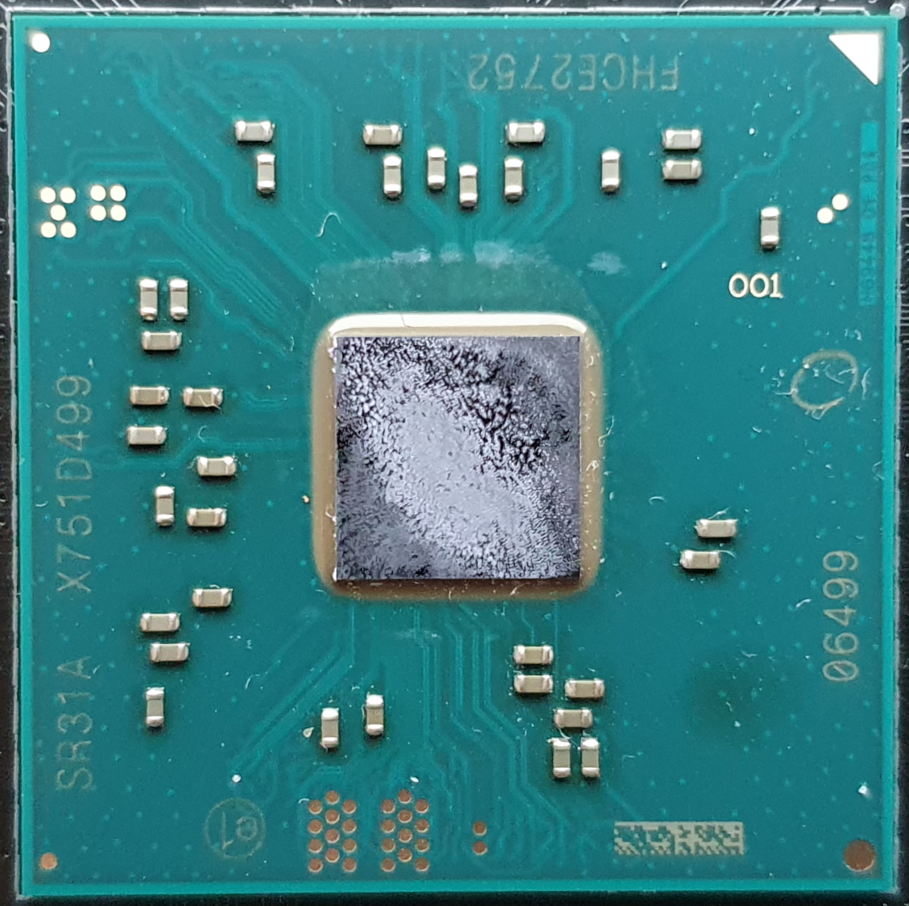
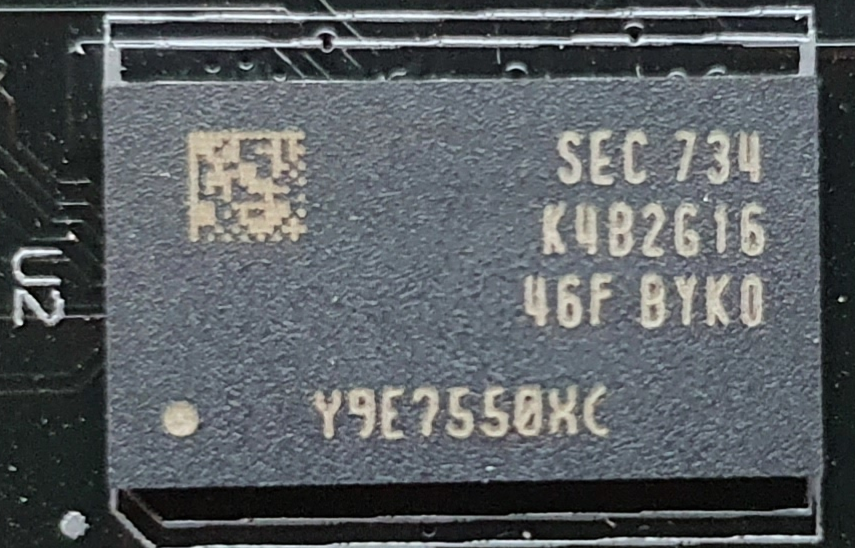
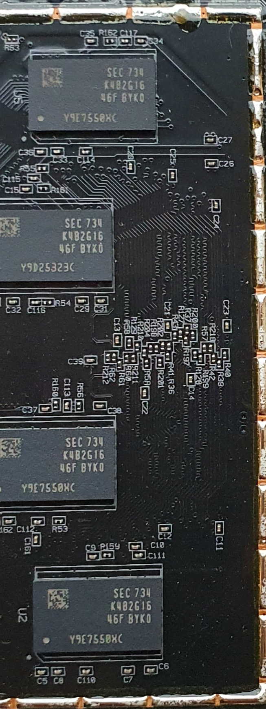
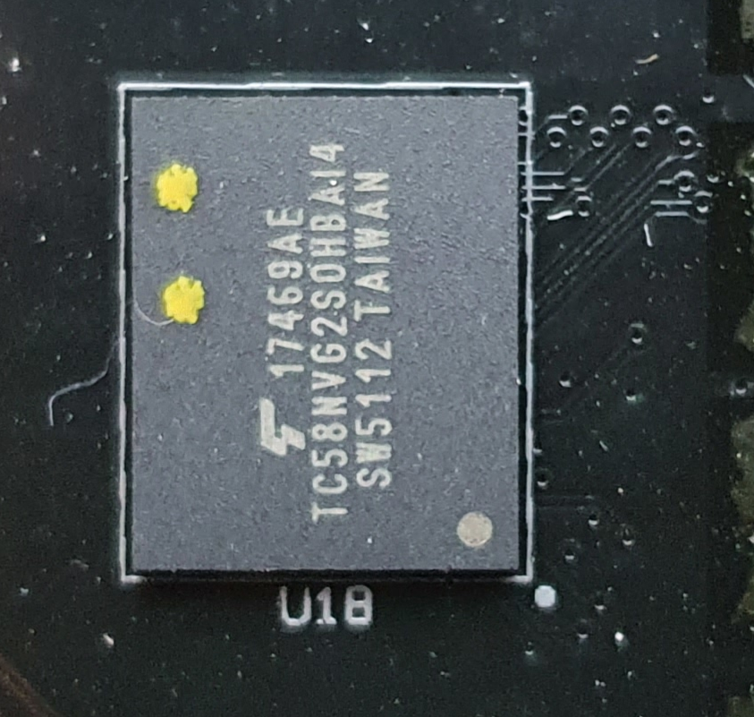
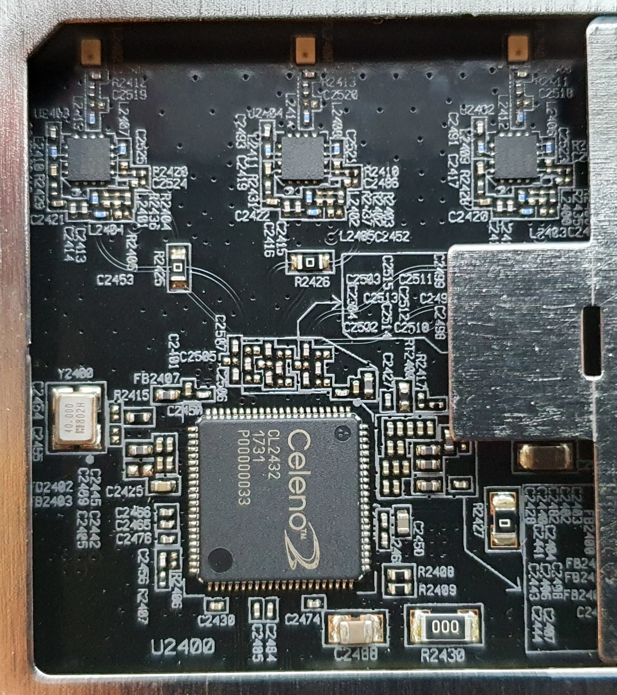
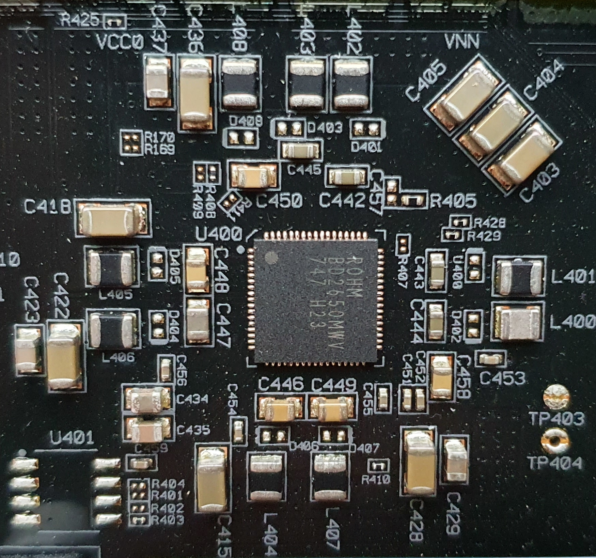
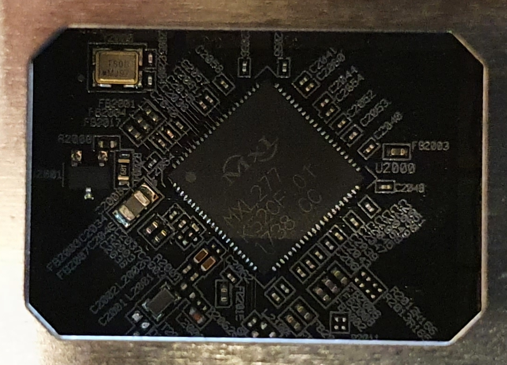
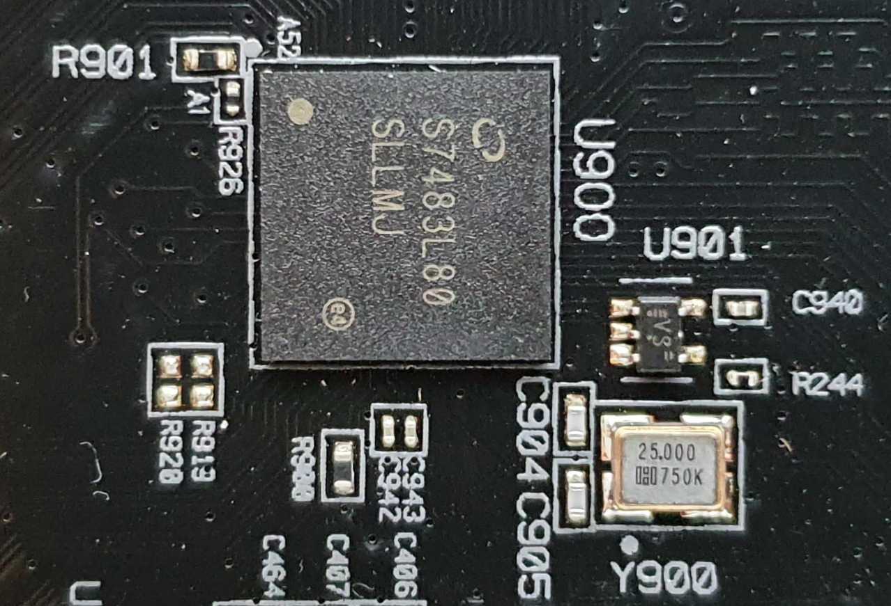
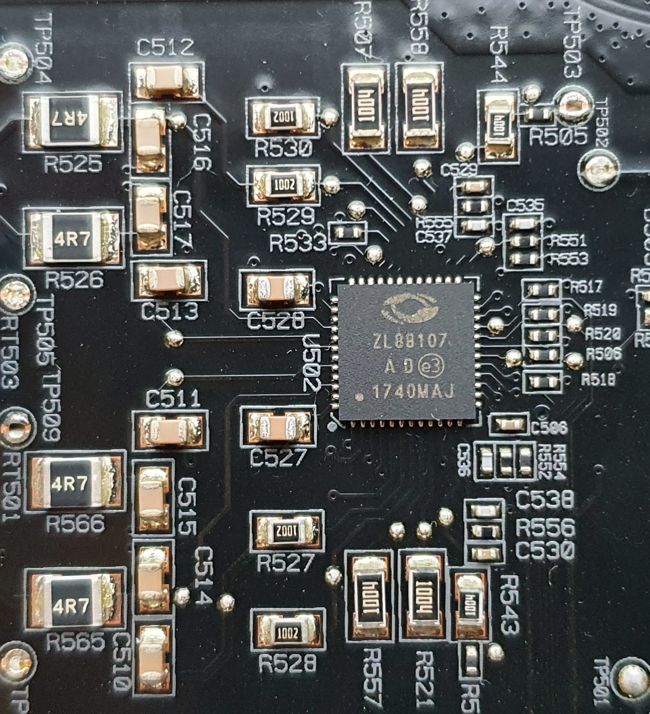
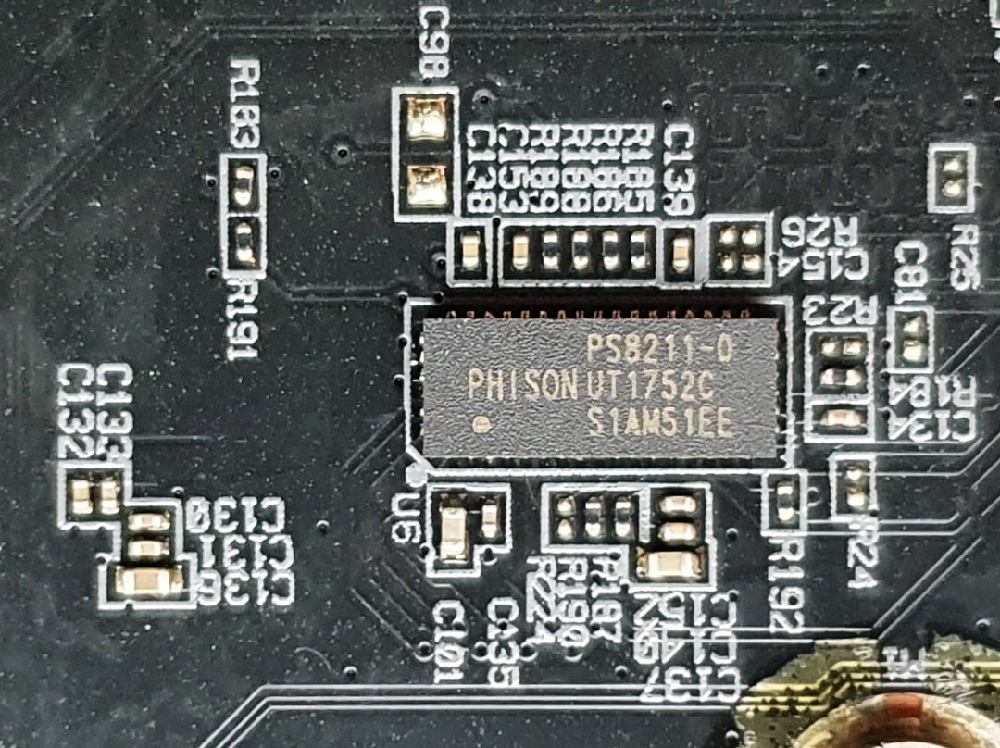

# Hardware identification

## Overview

1. CPU
2. RAM
3. Flash
4. 2.4 GHz RF chip
5. 5 GHz RF chip
6. ???Single Chip Power Management IC??? (only res found: [deviwiki.com search results](https://deviwiki.com/w/index.php?search=BD2650MWV)) [FIXME: place some better refs and infos]
7. Cable upstream amplifier
8. Cable gateway SoC
9. ???maybe the Ethernet chipset/driver/controller??? [FIXME: identify the chip and place some refs]
10. Subscriber Line IC
11. eMMC

## Identified Components

### CPU

`Intel FHCE2752M` (Intel Puma 7 SoC CE2752M) 2 cores, 2.5 GHz, Intel Atom Arch ([Intel Puma 7 product family page](https://ark.intel.com/content/www/de/de/ark/products/140087/intel-puma-7-family.html))

  
Photo

### RAM

4x `Samsung K4B2G1646F-BYK0` ???Capacity used (4x512 MByte?)??? DDR3-RAM ([Samsung product page](https://www.samsung.com/semiconductor/dram/ddr3/K4B2G1646F-BYK0/))  [FIXME: exact capacity]

  
Photo

### Flash

`Kioxia TC58NVG2S0HBAI4` 512 MByte SLC NAND EEPROM (Toshiba/[Kioxia product page](https://business.kioxia.com/en-us/memory/detail.TC58NVG2S0HBAI4.html))

  
Photo

### 2.4 GHz RF chip

`Celeno CL2432` 3x3 802.11ac 2.4GHz RF chip ([celeno.com product page](https://www.celeno.com/products/cl2432))

  
Photo

### 5 GHz RF chip

`Celeno CL2440` 4x4 802.11ac Wave 2 5GHz RF chip ([celeno.com product page](https://www.celeno.com/products/cl2440))

  
Photo

### Power Management IC

`ROHM BD2650MV` [FIXME: infos needed]

  
Photo

### Cable upstream amplifier

`MaxLinear MXL236` PGA IC designed for DOCSIS 3.1 ([maxlinear.com product page](https://www.maxlinear.com/product/access/cable-broadband/cable-front-ends/upstream-amplifiers/mxl236))

  
Photo

### Cable gateway SoC

`MaxLinear MXL277` cable gateway, front-end SoC designed for DOCSIS 3.1 ([maxlinear.com product page](https://www.maxlinear.com/product/access/cable-broadband/cable-front-ends/fsc-and-narrowband-tuners-demods/mxl277))

  
Photo

### Ethernetcontroller

[FIXME: infos and refs needed]

  
Photo

### Subscriber Line IC

`Microsemi ZL88107` Microsemi Corporation, ???maybe part of ZL880 series -> [product page](https://www.microchip.com/design-centers/interface-and-connectivity/line-circuits)??? [FIXME: exact ref and infos missing]

  
Photo

### eMMC

`Phison PS8211-0` [FIXME: exact infos and refs needed]

  
Photo

