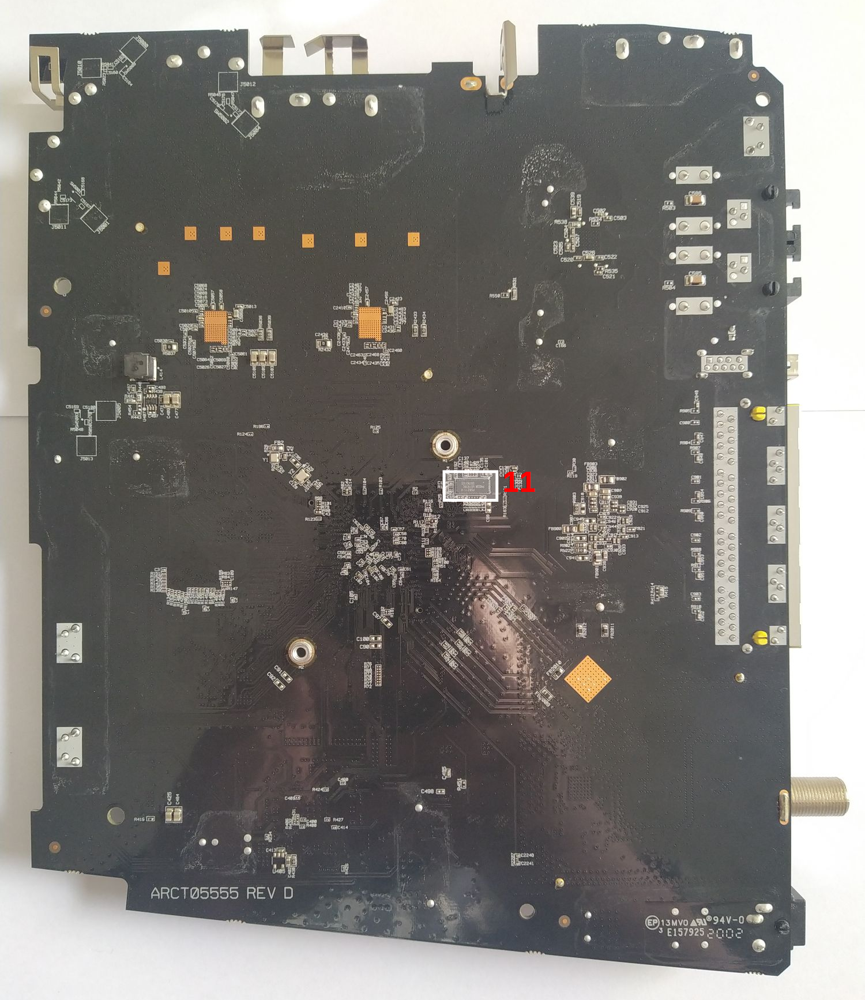

# Hardware identification (version MP2)

## Overview

1. CPU¹
2. RAM
3. Flash¹
4. 2.4 GHz RF chip¹
5. 5 GHz RF chip¹
6. ???Single Chip Power Management IC??? [FIXME: place some better refs and infos]
7. Cable upstream amplifier¹
8. Cable gateway SoC¹
9. Ethernet Switch
10. Subscriber Line IC¹
11. eMMC¹
12. ???SPI Bios chip??? [as mentioned by @arrobazo](https://github.com/nox-x/TG3442DE-Teardown/issues/3#issuecomment-874434710)
13. 2Bit Logic Level shifter¹ [as mentioned by @arrobazo](https://github.com/nox-x/TG3442DE-Teardown/issues/3#issuecomment-874434710)

## Identified Components

### CPU¹²³

`Intel FHCE2752(M?)` (Intel Puma 7 SoC CE2752M) 2 cores, 2.5 GHz, Intel Atom Arch ([Intel Puma 7 product family page](https://ark.intel.com/content/www/cn/zh/ark/products/140087/intel-puma-7-family.html))

  
Photo

[FIXME: add photos]

### RAM

4x `Nanya NT5CC128M16JR-EK` 2048MByte DDR3L-1866 ([Nanya product page](https://www.nanya.com/en/Product/4115/NT5CC128M16JR-EK))

  
Photo

[FIXME: add photos]

### Flash¹

`Kioxia TC58NVG2S0HBAI4` 512 MByte SLC NAND EEPROM (Toshiba/[Kioxia product page](https://business.kioxia.com/en-us/memory/detail.TC58NVG2S0HBAI4.html))

  
Photo

[FIXME: add photos]

### 2.4 GHz RF chip¹

`Celeno CL2432` 3x3 802.11ac 2.4GHz RF chip ([celeno.com product page](https://www.celeno.com/products/cl2432))

  
Photo

[FIXME: add photos]

### 5 GHz RF chip¹

`Celeno CL2440` 4x4 802.11ac Wave 2 5GHz RF chip ([celeno.com product page](https://www.celeno.com/products/cl2440))

  
Photo

[FIXME: add photos]

### Power Management IC

`ROHM BD2651MWV-E2` [FIXME: infos needed]

  
Photo

[FIXME: add photos]

### Cable upstream amplifier¹

`MaxLinear MXL236` PGA IC designed for DOCSIS 3.1 ([maxlinear.com product page](https://www.maxlinear.com/product/access/cable-broadband/cable-front-ends/upstream-amplifiers/mxl236))

  
Photo

[FIXME: add photos]

### Cable gateway SoC¹

`MaxLinear MXL277` cable gateway, front-end SoC designed for DOCSIS 3.1 ([maxlinear.com product page](https://www.maxlinear.com/product/access/cable-broadband/cable-front-ends/fsc-and-narrowband-tuners-demods/mxl277))

  
Photo

[FIXME: add photos]

### Ethernet Switch

`Intel GSW140 SLMHB` 1G Ethernet Switch IC ([Intel product page](https://ark.intel.com/content/www/cn/zh/ark/products/96259/intel-ethernet-switch-1g-switch.html))

  
Photo

[FIXME: add photos]

### Subscriber Line IC¹

`Microsemi ZL88107` Microsemi Corporation, ???maybe part of ZL880 series -> [product page](https://www.microchip.com/design-centers/interface-and-connectivity/line-circuits)??? [FIXME: exact ref and infos missing]

  
Photo

[FIXME: add photos]

### eMMC¹

`Phison PS8211-0` [FIXME: exact infos and refs needed]

  
Photo

[FIXME: add photos]

### SPI Bios

Unknown model/manufacturer, WLCSP package, reads `949` in line 1 and `0D` in line 2.

  
Photo

[FIXME: add photos]

### 2Bit Logic Level shifter¹

`Texas Instruments SN74AVC2T245RSWR` Dual-Bit, 2-DIR pin Dual-Supply Bus Transceiver w/ Configurable Voltage Translation ([product page](https://www.ti.com/store/ti/en/p/product/?p=SN74AVC2T245RSWR))
[As mentioned by @arrobazo](https://github.com/nox-x/TG3442DE-Teardown/issues/3#issuecomment-874434710) shifting 1V8 TTL to 3V3 level of the ATOM core console interface.
Not normally shipped with OEM setups (see Photo).

  
Photo

[FIXME: add photos]

## Footnotes

¹: Same component/IC/chip as in [version MP1](../Hardware.md).
²: Info on this chip is hard to come by. Version MP1 of the modem has `SR31A` printed on it, for version MP2 it says `SR3S7`.
³: [FIXME: Neither version has the `M` appendix - is this correct?]
